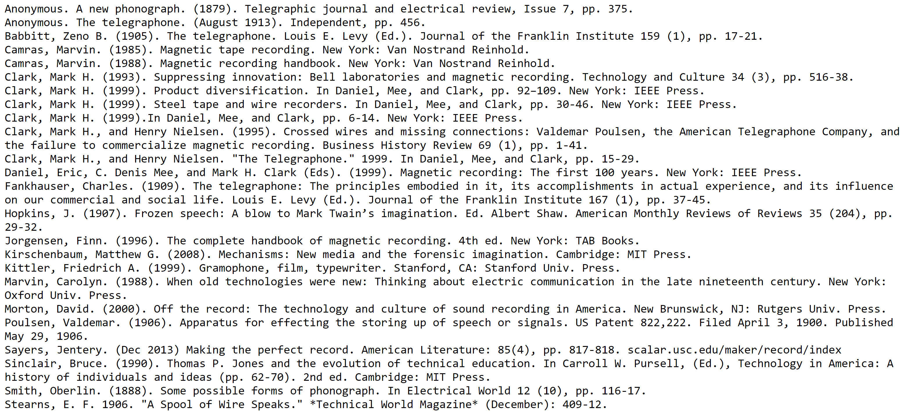

# Magnetic Recording Kit (2016)

This repository contains files for the "Early Wire Recording Experiment" made by the Maker Lab in the Humanities (MLab) at the University of Victoria ([http://maker.uvic.ca/](http://maker.uvic.ca/)). The Early Wire Recording Experiment prompts users to repeat the earliest known magnetic recording experiment, conducted by Valdemar Poulsen as early as 1898. Poulsen holed up in a cabin in rural Denmark where he recorded, replayed, erased, and rerecorded the name, "Jacob." He strung piano wire from one side of his room to the other. Then he ran alongside the wire with a trolley containing an electromagnet. For parts, Poulsen deconstructed a wall-mounted telephone. He magnetized the wire by connecting a telephone transmitter, battery and electromagnet in a circuit. As he yelled into the transmitter and the electromagnet ran along the wire, his voice left a magnetic trace along the wire. For playback, he would connect the receiver to the electromagnet. As the electromagnet ran over the magnetized sections of the wire, it caused the receiver’s diaphragm to vibrate, indicating playback. The only known account of this experiment is in [Marvin Camras’ Magnetic Recording Handbook](https://books.google.ca/books?id=PdruCAAAQBAJ&q=Poulsen#v=snippet&q=Poulsen&f=false). It contains a simple stick figure drawing of how the experiment was said to work.

We imitated this experiment and exhibited it on the UVic campus at the [Audain Gallery](https://finearts.uvic.ca/visualarts/events/galleries/), in the Visual Arts Building from Tuesday, June 14th through Friday, June 17th. As users shouted into the transmitter, they left a trace along the wire, visible when iron filings were held up to the wire. In contrast, playback was unreliable and almost impossible to hear. At best, we were only able to hear small clicks as the electromagnet passed over magnetized sections. Since Poulsen’s experiment took place before Direct Current (DC) bias or amplification, we speculate that playback in this first iteration was far from reliable. Poulsen may have been more interested in recording and erasing over the same material than he was in ensuring reliable playback.  

The Wire Recording Experiment is Volume 2 in the MLab's Kits for Cultural History series (see [Volume 1: Early Wearables Kit](https://github.com/uvicmakerlab/earlyWearablesKit)). It was made with support from the Social Sciences and Humanities Research Council (SSHRC), the Canada Foundation for Innovation (CFI), and the British Columbia Knowledge Development Fund (BCKDF).

## Overview
*  [History](#history)
*  [Parts](#parts)
*  [Exhibit](#exhibit)
*  [Instructions](#instructions)
*  [Guide](#guide)
*  [Technologies](#tech)
*  [Further Reading](#further)
*  [Process Documentation](#process)
*  [Disclaimer](#disclaimer)
*  [Contributors](#contributors)
*  [License and DOI](#license)
*  [Change Log](#change)

## History

The first known reference to magnetic recording was in an article published by Oberlin Smith in Electrical World, Sep. 8, 1888. Smith had visited Thomas Edison’s Menlo Park laboratory ten years earlier and was dissatisfied with Edison’s cylinder phonograph, which generated a scratchy noise during playback. As a response, he proposed magnetic recording, where no audible, physical contact would be made between the storage medium (for example, thread) and the playback mechanism (for example, an electromagnet). Historians are unsure whether he ever invented a system where any medium reproduced audible results. They are, however, quite certain that he never obtained a patent for magnetic recording, a magnetic recording device, or a magnetic storage medium. Although there is no evidence that he read Oberlin Smith’s work, that year an engineer by the name of Valdemar Poulsen experimented with storing voices on piano wire. These experiments initially occurred in his laboratory at the Copenhagen Telephone Company in Denmark. According to Marvin Camras (1985, 1), a historian and practitioner of magnetic recording, Poulsen would stretch magnetic wire across the diagonal width of a room, from the top corner to its opposite bottom corner. To that wire, he would attach a trolley, which carried an electromagnet, battery, and telephone transmitter. As the trolley rolled down the wire, he would run alongside it, shouting into the transmitter. This process would then be repeated, but with a receiver instead of a transmitter. As the trolley rolled down the wire again, Poulsen would have a friend listen to the playback through an earpiece. The playback could be repeated (ostensibly without deterioration in audio quality), with people taking turns to individually listen. Better yet, they could then witness Poulsen wiping the record clean with a strong magnet, only to rerecord on the same medium. 

## Parts

This folder contains images or files of the key components for this experiment. The list below provides details concerning each of these parts. 

**Transmitter and Receiver:** For the transmitter and receiver we used disassembled parts from a 1901 Kellogg phone. Although Poulsen conducted his experiment as early as 1898, records suggest telephone parts were standardized from the 1890’s to the 1920’s, so any phone parts from that time period should be appropriate for this experiment. Images of the phone parts we used for this experiment are included in the parts folder.

**Piano Wire:** Piano wire was provided by [Alison Piano](http://www.allisonpiano.bc.ca/). We used turnbuckles on each end, which allowed us to tighten the wire after it was mounted. We found a higher gauge to be more effective for this experiment.

**Electromagnet:** We built our electromagnets by wrapping [soft iron rods](http://www.xump.com/science/Soft-Iron-Rod.cfm) in copper wire. 

**Trolley:** We cut the parts for our trolley using an Epilogue Helix Laser Cutter. There are three parts for the trolley in the parts folder, the wheels, interior parts and exterior parts. We also purchased nuts and bolts for mounting the completed trolley onto the wire. 

**Iron Filing Box:** You can test which sections of the wire were magnetized by holding iron filings against the wire. We built a box to hold the filings. The box had grooves on either end that would allow the iron filings to be held directly against the wire. The plans for laser cutting this box are included in the parts folder.

**Magnet Case:** You can erase any magnetic trace by sliding a permanent magnet along the wire. We inserted two permanent magnets in a laser cut case that users could hold against the wire. The plans for the laser cut case are included in the parts folder. 

## Exhibit

The exhibit was constructed by hanging two piano wires across the gallery space. On the left side, the piano wire was mounted at an incline, as described in accounts of Poulsen’s experiment. Behind this wire we hung eight instructional photos. During the week of the exhibit we provided three demonstrations of the experiment using this wire. On the right side of the room, we mounted another wire parallel to the floor. We allowed visitors to leave their own trace on this wire and stuck labels onto the wire next to their trace, indicating the word or phrase they had imprinted on the wire. On the wall directly across from the exhibit entrance, we mounted a phone box containing the audio guide. The exhibit folder contains photos from this event.

## Instructions

This folder contains an outline of the instructions provided during the exhibit demonstrations, along with the instructional photos. 

## Guide

This folder contains a transcript and MP3 version of the audio guide. During the exhibit, we used a [lilypad MP3](https://www.sparkfun.com/products/11013) player to automatically play the audio guide. The lilypad was inside a telephone box and we ran headphones into an extra receiver case. When exhibit visitors would lift the receiver from it’s handle, it would automatically trigger the audio guide to play. We used copper wire and copper tape to complete the circuit that would trigger the guide to play. 

## Technologies

The Early Recording Experiment is made of wood, paper, ink, acrylic, wire, magnets, iron, steel, nuts, theory, bolts, lasers, trial, Myriad Pro font, photographs, metadata, extra-illustration, error, CAD files, 9 volts, Internet, critique, repetition, patience, annotations, and cardboard. The MLab fabricated the object files with an Epilog laser cutter, a MakerBot 3-D printer, a Roland SRM-20 milling machine, and a ShopBot PRSalpha CNC spindle. For software and digitization, we relied heavily on SketchUp, CorelDRAW, Illustrator, Photoshop, 123D Make, Agisoft PhotoScan, FlexScan3D, Python, Git, a Nikon 5300, a Canon T3i, and an LMI HDI structured-light 3-D scanner.

## Further Reading

[furtherReading.txt](furtherReading.txt) contains a list of materials, including primary sources, informing the history at work in the Early Recording Experiment. The list also references publications that shaped the MLab's methodology for media history and rapid prototyping.

## Process Documentation

For additional process documentation pertaining to the Early Recording Experiment, see the MLab's website at [http://maker.uvic.ca](http://maker.uvic.ca/kch/). 

## Disclaimer

This repository is intended primarily for archival purposes. It does not contain the complete contents of the Early Wearables Kit, including contents that cannot be digitized: demanufactured phone parts, enamel-insulated copper wire, D-cell batteries, lilypad MP3, soft iron core, and nuts, bolts, turnbuckles, screws and other parts used for constructing the exhibit.

## Contributors

Since 2015, the following researchers have contributed to the Early Wearables Kit: Nina Belojevic, Teddie Brock, Tiffany Chan, Nicole Clouston, Katherine Goertz, Shaun Macpherson, Danielle Morgan, Victoria Murawski, Jentery Sayers, and William J. Turkel. The Social Sciences and Humanities Research Council, the Canada Foundation for Innovation, and the British Columbia Knowledge Development Fund have supported this research.

## License and Digital Object Identifier

The Early Wearables Kit is licensed [CC BY-SA 4.0](http://creativecommons.org/licenses/by-sa/4.0/). Attribution should be given to the Maker Lab in the Humanities at the University of Victoria (maker.uvic.ca). The Digital Object Identifier (DOI) for the Kit is ?

## Change Log

This is Version 1.1 of the Early Recording Experiment (Volume 2 in the Kits for Cultural History series). All files for this version were updated on …. , and the MLab publicly launched this repository on ….. With Version 1.1, we gave the repository a DOI.

